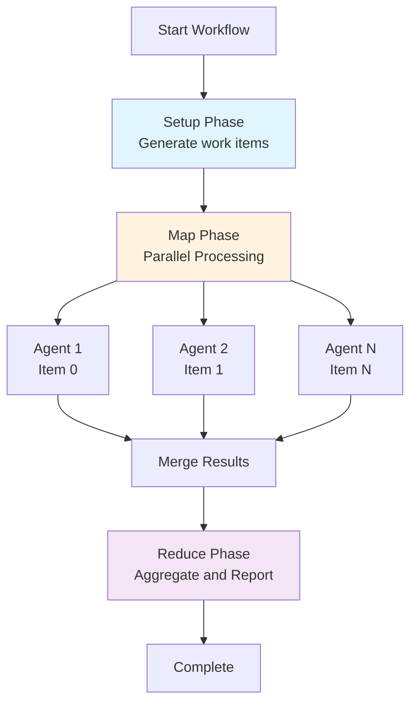
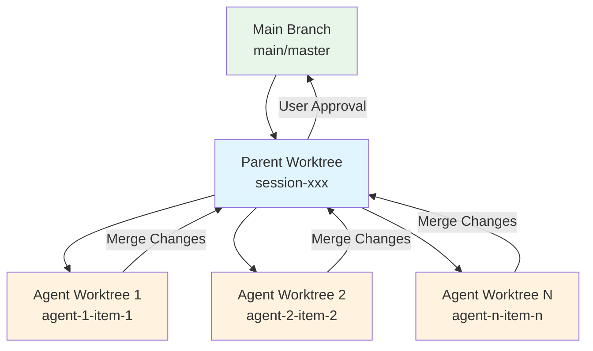
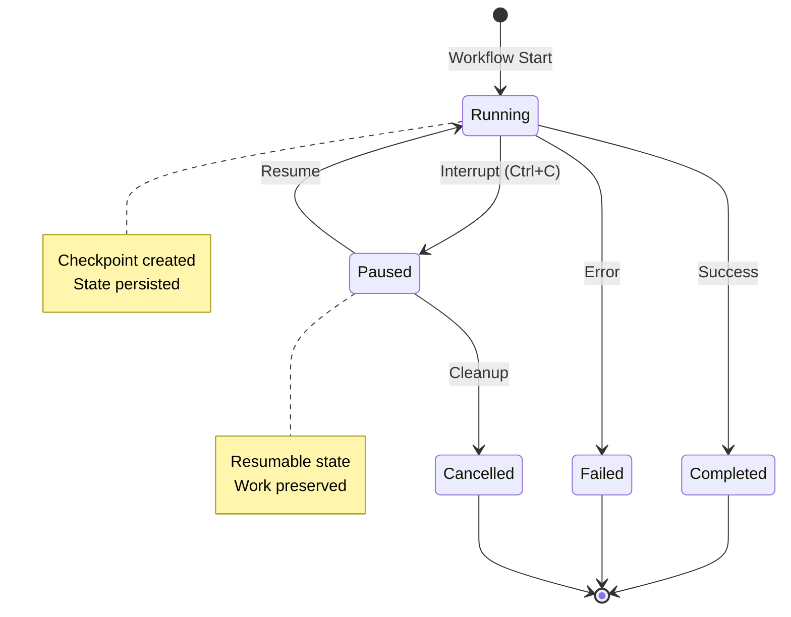
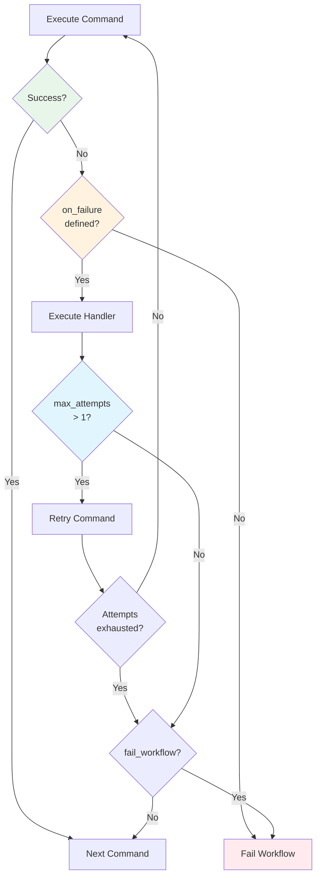
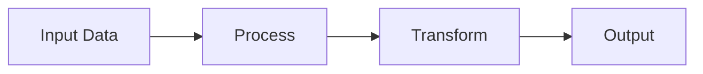
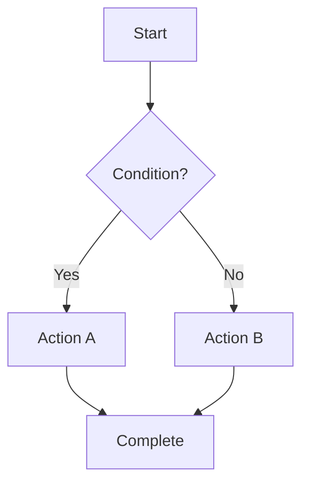
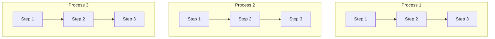
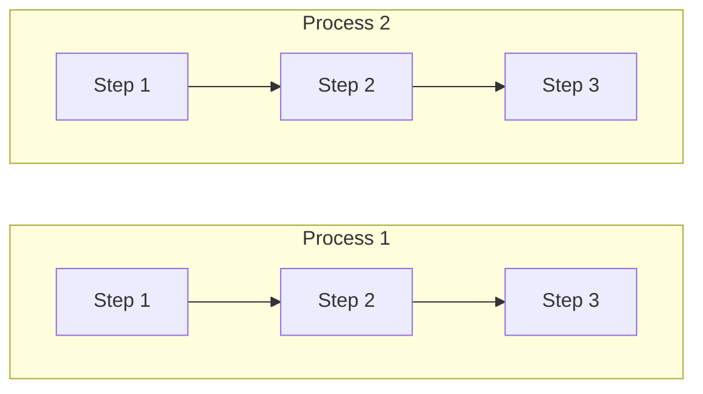
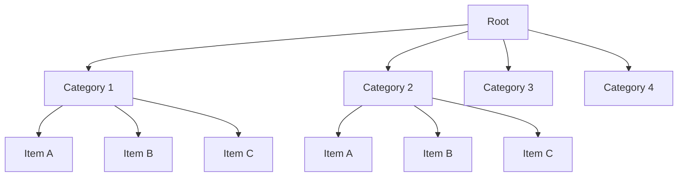
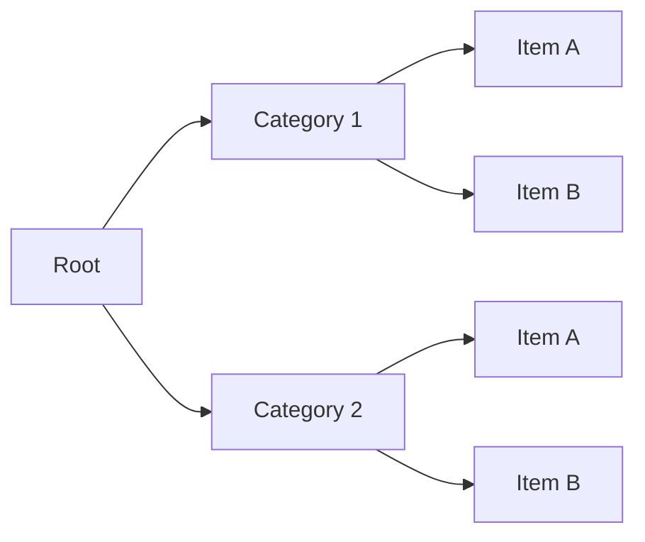

# /prodigy-enhance-mkdocs-page

Enhance a single MkDocs page with Material theme features (diagrams, admonitions, code annotations) based on the page's specific content and context. This runs in the map phase where you have full context about what the page discusses.

## Variables

- `--project <name>` - Project name (e.g., "Prodigy")
- `--json <item>` - Work item JSON containing file, title, topics, section info
- `--auto-fix <boolean>` - Automatically add enhancements (default: true)

## Execute

### Phase 1: Understand Context

You are enhancing **a single documentation page** as part of the map phase. You have full context about:
- The page's content (you've already analyzed it for drift)
- The topics it covers (from work item metadata)
- The section it belongs to
- What concepts it explains

**Your Goal**: Add Material MkDocs features that genuinely improve this specific page:
- **Mermaid diagrams** for complex flows/architectures
- **Admonitions** (!!!tip, !!!warning, !!!example) at decision points
- **Code annotations** for complex examples
- **Tabbed content** for platform-specific or alternative approaches

**Critical Principles**:
1. **Context-driven**: Generate diagrams based on what THIS page actually explains
2. **Strategic placement**: Add admonitions where they help (pitfalls, tips, examples)
3. **Quality over quantity**: Only add features that genuinely improve understanding
4. **Preserve accuracy**: Don't change technical content, only enhance presentation

### Phase 2: Extract Parameters

```bash
PROJECT_NAME="${project:?Error: --project is required}"
ITEM_JSON="${json:?Error: --json work item is required}"
AUTO_FIX="${auto_fix:-true}"

# Parse work item
FILE=$(echo "$ITEM_JSON" | jq -r '.file')
TITLE=$(echo "$ITEM_JSON" | jq -r '.title')
TOPICS=$(echo "$ITEM_JSON" | jq -r '.topics[]?' | tr '\n' ',' | sed 's/,$//')
SECTION_ID=$(echo "$ITEM_JSON" | jq -r '.section_id // "none"')

# Validate
if [ ! -f "$FILE" ]; then
    echo "Error: File not found: $FILE"
    exit 1
fi

echo "Enhancing: $TITLE"
echo "  File: $FILE"
echo "  Topics: $TOPICS"
echo "  Section: $SECTION_ID"
```

### Phase 3: Read and Analyze Page Content

**Read the entire page to understand what it explains:**

```bash
# Read the page content
CONTENT=$(cat "$FILE")

# Count current features
CURRENT_DIAGRAMS=$(echo "$CONTENT" | grep -c "^\`\`\`mermaid" || echo 0)
CURRENT_ADMONITIONS=$(echo "$CONTENT" | grep -c "^!!!" || echo 0)
CURRENT_TABS=$(echo "$CONTENT" | grep -c "^=== " || echo 0)

echo ""
echo "Current features:"
echo "  Diagrams: $CURRENT_DIAGRAMS"
echo "  Admonitions: $CURRENT_ADMONITIONS"
echo "  Tabs: $CURRENT_TABS"
```

### Phase 4: Content Analysis for Diagram Opportunities

**Analyze what this page explains to determine if a diagram would help:**

Based on the page content and topics, identify:

1. **Architecture/Structure**: Does it explain components, hierarchy, organization?
2. **Flow/Process**: Does it explain sequences, workflows, execution steps?
3. **State/Lifecycle**: Does it explain transitions, states, conditions?
4. **Relationships**: Does it explain how things connect or interact?

**Complexity Indicators** (suggests diagram would help):
- Multiple phases/steps described
- "First... then... finally..." patterns
- Component relationships
- Branching logic (if/else, success/failure)
- Parent/child hierarchies

### Phase 5: Generate Context-Aware Enhancements

Based on the specific page content, generate appropriate enhancements:

#### A. Diagram Generation (if appropriate)

**For MapReduce/Workflow pages:**

If the page discusses **workflow execution, phases, or processing flow**, generate a flowchart or graph:

```markdown
## Example: MapReduce Overview Page

After analyzing content about "Setup → Map → Reduce" phases:

**Add after "## The Three Phases" heading:**



**Figure**: MapReduce execution flow showing parallel agent processing.
```

**For Architecture/Structure pages:**

If the page discusses **component hierarchy, isolation, or organization**:

```markdown
## Example: Worktree Isolation Page

After analyzing content about worktree branching:

**Add after "## Isolation Architecture" heading:**



**Figure**: Worktree isolation showing how agents branch from parent and merge back.
```

**For State/Lifecycle pages:**

If the page discusses **states, transitions, or lifecycle**:

```markdown
## Example: Session Lifecycle Page

After analyzing content about session states:

**Add after "## Session States" heading:**



**Figure**: Session lifecycle showing state transitions and checkpoint behavior.
```

**For Error Handling/Decision Flow:**

If the page discusses **error handling, retry logic, or decision flows**:

```markdown
## Example: Error Handling Page

After analyzing content about on_failure behavior:

**Add after "## Error Handling Flow" heading:**



**Figure**: Error handling flow showing retry logic and failure propagation.
```

**Diagram Layout Best Practices:**

Choose the appropriate layout direction based on content structure:

**Use Horizontal Layout (`graph LR` or `flowchart LR`) when:**
- Showing sequential/linear processes (Step 1 → Step 2 → Step 3)
- Displaying algorithm execution steps
- Showing before/after transformations
- Content is primarily sequential with few branches



**Use Vertical Layout (`graph TD` or `flowchart TD`) when:**
- Showing hierarchical structures (parent → children)
- Decision trees with multiple branches
- Workflows with conditional logic
- Component hierarchies
- **BUT: Keep it narrow** (max 3-4 branches wide)



**Avoid These Layout Mistakes:**

❌ **Multiple vertical subgraphs with linear content** - renders too small:

This stacks narrow sequences vertically, making them unreadable.

✅ **Instead, use horizontal subgraphs:**

This makes better use of screen width and improves readability.

❌ **Wide hierarchical diagram with graph TD** - text becomes unreadable:


✅ **Instead, use graph LR for wide hierarchies:**


✅ **Or break into focused sub-diagrams:**
Instead of one massive hierarchy, create separate diagrams for each category.
Each diagram stays readable and focused on one concept.

**Critical Readability Rules:**

1. **Maximum width for TD/TB layouts**: 4 branches at widest point
2. **Maximum leaf nodes**: 8 nodes spread horizontally (2x4 grid max)
3. **For wide hierarchies (>4 branches)**: Use `graph LR` instead
4. **For deep + wide diagrams**: Split into multiple focused diagrams
5. **Test diagram readability**: If you need to zoom in to read labels, it's too complex

#### B. Admonition Placement (strategic locations)

Read the page content and add admonitions where they genuinely help:

**1. Before Common Pitfalls:**

Look for content discussing common mistakes, errors, or things that can go wrong:

```markdown
# If page mentions "Be careful not to..." or "Common mistake..."

!!! warning "Common Pitfall"
    Setting `max_parallel` too high can exhaust system resources. Start with 5-10 and monitor performance before increasing.
```

**2. Before Best Practices:**

Look for recommendations, tips, or optimal approaches:

```markdown
# If page mentions "Recommended approach..." or "Best practice..."

!!! tip "Best Practice"
    Always test MapReduce workflows with a small subset first (using `max_items: 10`) before running on the full dataset.
```

**3. Before Examples:**

When introducing code examples:

```markdown
# Before significant code blocks

!!! example "Basic Configuration"
    Here's how to configure environment variables with profiles:
```

**4. For Important Notes:**

When highlighting critical information:

```markdown
# If page has **Important:** or **Note:** sections

!!! note "Important"
    Environment variables are resolved in this order: workflow env block → system environment → error if not found.
```

**5. For Performance Guidance:**

When discussing performance characteristics:

```markdown
# If page discusses performance, scaling, or resource usage

!!! tip "Performance Sweet Spot"
    MapReduce excels with 10-1000 work items that each take 10 seconds to 5 minutes to process.
```

#### C. Code Annotations (for complex examples)

For code blocks with multiple configuration options, add inline annotations:

```markdown
# Before (plain code):
```yaml
map:
  max_parallel: 10
  filter: "severity >= 5"
  sort_by: "priority DESC"
```

# After (with annotations):
```yaml
map:
  max_parallel: 10           # (1)!
  filter: "severity >= 5"    # (2)!
  sort_by: "priority DESC"   # (3)!

1. Controls how many agents run concurrently
2. Only process items matching this condition
3. Process high-priority items first
```
```

**When to add annotations:**
- Code blocks with 5+ configuration fields
- Complex YAML structures
- Non-obvious parameter meanings
- Critical configuration values

#### D. Tabbed Content (for alternatives/platforms)

Look for platform-specific content or alternative approaches:

**Platform-specific paths:**

```markdown
# Before (list format):
Configuration is stored in:
- Linux: `~/.config/prodigy/`
- macOS: `~/Library/Application Support/prodigy/`
- Windows: `C:\Users\<username>\AppData\Roaming\prodigy\`

# After (tabbed):
Configuration is stored in:

=== "Linux"
    ```bash
    ~/.config/prodigy/
    ```

=== "macOS"
    ```bash
    ~/Library/Application Support/prodigy/
    ```

=== "Windows"
    ```cmd
    C:\Users\<username>\AppData\Roaming\prodigy\
    ```
```

**Alternative approaches:**

```markdown
# If page shows multiple valid approaches

=== "Simple Syntax"
    ```yaml
    - shell: "cargo build"
    - shell: "cargo test"
    ```

=== "Detailed Syntax"
    ```yaml
    commands:
      - command:
          shell: "cargo build"
        timeout: 300
      - command:
          shell: "cargo test"
        on_failure:
          claude: "/fix-tests"
    ```
```

### Phase 6: Apply Enhancements

If `--auto-fix true`, apply the enhancements you identified:

```bash
if [ "$AUTO_FIX" = "true" ]; then
    echo ""
    echo "Applying enhancements to $FILE..."

    # Backup file
    cp "$FILE" "$FILE.bak"

    # Track what we added
    DIAGRAMS_ADDED=0
    ADMONITIONS_ADDED=0
    TABS_ADDED=0

    # Read the file content for analysis
    CONTENT=$(cat "$FILE")

    # Add enhancements based on content analysis
    # (This is where you apply the specific enhancements you identified)

    # After modifications, check if changes were made
    if ! diff -q "$FILE" "$FILE.bak" >/dev/null 2>&1; then
        # Calculate what was added
        DIAGRAMS_ADDED=$(grep -c "^\`\`\`mermaid" "$FILE" - grep -c "^\`\`\`mermaid" "$FILE.bak" || echo 0)
        ADMONITIONS_ADDED=$(grep -c "^!!!" "$FILE" - grep -c "^!!!" "$FILE.bak" || echo 0)

        echo "  ✓ Added $DIAGRAMS_ADDED diagram(s)"
        echo "  ✓ Added $ADMONITIONS_ADDED admonition(s)"

        # Remove backup
        rm "$FILE.bak"

        # Commit changes
        git add "$FILE"
        git commit -m "docs: enhance $TITLE with visual features

- Added diagrams for complex flows
- Added strategic admonitions
- Improved code examples

Page: $FILE"

        exit 0  # Success
    else
        echo "  ℹ No enhancements needed (page quality is good)"
        rm "$FILE.bak"
        exit 0
    fi
else
    echo ""
    echo "Report mode (--auto-fix false):"
    echo "  Identified enhancement opportunities for $TITLE"
    echo "  Run with --auto-fix true to apply changes"
    exit 0
fi
```

### Phase 7: Specific Page Enhancement Logic

**IMPORTANT**: You need to READ the page content and understand what it explains to generate appropriate diagrams and admonitions. Here's the approach:

#### For Each Page Type:

**1. MapReduce/Workflow Pages**
- Look for: Phase descriptions, execution flow, parallel processing
- Add: Flow diagrams (graph TD or flowchart)
- Admonitions: Performance tips, resource warnings, testing recommendations

**2. Configuration/Settings Pages**
- Look for: Configuration options, precedence rules, file locations
- Add: Platform-specific tabs, configuration examples
- Admonitions: Best practices, common mistakes, security warnings

**3. Error Handling Pages**
- Look for: Error flows, retry logic, failure handling
- Add: Flowcharts showing decision logic
- Admonitions: Warnings about pitfalls, tips for debugging

**4. Architecture/Design Pages**
- Look for: Component structure, isolation, relationships
- Add: Architecture diagrams (graph TD with hierarchy)
- Admonitions: Design rationale, trade-offs, use cases

**5. Getting Started/Tutorial Pages**
- Look for: Step-by-step instructions, examples
- Add: Example admonitions, tip admonitions
- Code annotations for complex examples

### Success Criteria

- [ ] Read and understood the page content
- [ ] Identified appropriate diagram type based on what page explains
- [ ] Generated diagram with accurate labels matching page content
- [ ] Placed diagram at optimal location (after relevant heading)
- [ ] Added admonitions at strategic locations (pitfalls, tips, notes)
- [ ] Only enhanced where it genuinely improves understanding
- [ ] Preserved all technical accuracy
- [ ] Committed changes with descriptive message

### Quality Guidelines

**Good Enhancements:**
- ✅ Diagram shows the actual flow/structure the page describes
- ✅ Admonitions appear at decision points or gotchas
- ✅ Code annotations explain non-obvious parameters
- ✅ Tabs used for genuine alternatives or platform differences
- ✅ Diagram labels use proper spacing (e.g., "Search and Suppress" not "SearchAndSuppress")
- ✅ Multi-line labels use quoted syntax with actual newlines, not HTML `<br/>` tags
- ✅ Horizontal layout (`graph LR` or `flowchart LR`) for sequential/linear processes
- ✅ Horizontal layout for wide hierarchies (>4 branches)
- ✅ Vertical layout (`graph TD` or `flowchart TD`) only for narrow hierarchies (≤4 branches wide)
- ✅ Text remains readable without zooming (test before committing)

**Bad Enhancements:**
- ❌ Generic diagram that doesn't match page content
- ❌ Too many admonitions (cluttered page)
- ❌ Annotations stating the obvious
- ❌ Tabs for single-variant content
- ❌ Compound words without spaces in diagram labels (e.g., "SearchAndSuppress")
- ❌ HTML tags like `<br/>` or HTML entities like `&#40;` in Mermaid diagrams
- ❌ Vertical layout for linear sequences (renders too small and narrow)
- ❌ Multiple subgraphs stacked vertically with sequential content (unreadable)
- ❌ Wide hierarchies with `graph TD` (>4 branches = unreadable text)
- ❌ Deep + wide diagrams (>8 leaf nodes = needs splitting or `graph LR`)
- ❌ Diagrams where you need to zoom to read the text

### Examples of Context-Aware Enhancement

**Example 1: docs/mapreduce/overview.md**

After reading the page, you see it explains:
- Three phases: Setup, Map, Reduce
- Parallel agent execution
- Agent isolation in worktrees

You add:
1. **Diagram** showing Setup → Map (with parallel agents) → Reduce flow
2. **!!!tip** before max_parallel discussion about starting small
3. **!!!warning** before resource limits section
4. **Code annotation** on max_parallel: "Controls concurrent agents"

**Example 2: docs/configuration/global-config.md**

After reading the page, you see it explains:
- Configuration file locations (platform-specific)
- Configuration precedence
- Available settings

You add:
1. **Tabs** for platform-specific config file paths
2. **!!!note** explaining precedence order
3. **!!!tip** about when to use global vs project config
4. **Code annotations** on key configuration fields

**Example 3: docs/workflow-basics/error-handling.md**

After reading the page, you see it explains:
- on_failure handlers
- Retry logic with max_attempts
- fail_workflow behavior

You add:
1. **Flowchart** showing command → error → handler → retry flow
2. **!!!warning** about max_attempts > 1 enabling automatic retries
3. **!!!example** showing common error handling patterns
4. **Code annotations** on on_failure fields

### Error Handling

**Page not found:**
```
Error: File not found: $FILE
Verify work item JSON has correct file path.
```

**No enhancements needed:**
```
✓ Page quality is good
No enhancements identified for this page.
```

**Diagram placement failed:**
```
Warning: Could not find optimal diagram location
Skipping diagram for this page.
```
